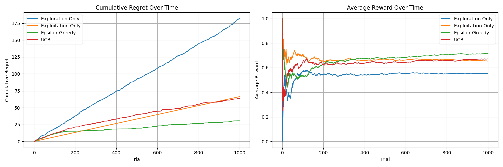

# ASSIGNMENT 2

## Overview
This assignment demonstrates the implementation and comparison of various Multi-Armed Bandit (MAB) algorithms. The goal is to explore the trade-off between exploration and exploitation in reinforcement learning using a simulated environment.

## Visualization
The provided image illustrates the performance of different algorithms over time:

### Cumulative Regret Over Time
- **Exploration Only**: Exhibits the highest cumulative regret due to random exploration without exploiting known information.
- **Exploitation Only**: Shows moderate regret as it gets stuck in local optima, failing to explore better options.
- **Epsilon-Greedy**: Balances exploration and exploitation effectively, resulting in low cumulative regret.
- **UCB**: Achieves a good balance between exploration and exploitation, with moderate cumulative regret.

### Average Reward Over Time
- **Exploration Only**: Results in the lowest average reward due to lack of exploitation.
- **Exploitation Only**: Quickly stabilizes but misses better options due to lack of exploration.
- **Epsilon-Greedy**: Provides the highest average reward by balancing exploration and exploitation.
- **UCB**: Achieves a high average reward, slightly lower than Epsilon-Greedy.

## Conclusion
This assignment provides hands-on experience with MAB algorithms and their practical applications. The visualization helps understand the trade-offs and challenges in reinforcement learning.
